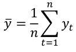
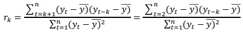
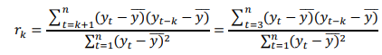

# autocorrelationHelper
Python helper program to calculate first and second order autocorrelation coefficients

A small helper program I created for my Stochastic Systems and Estimations undergraduate subject.

You can load the timeseries data via a plain text or an .xlsx file (examples included).

First it finds the arithmetic mean (average) of the timeseries:

It uses the following formulae for first and second order autocorrelation coefficients:
 
First order:
 

 
Second order:
 

